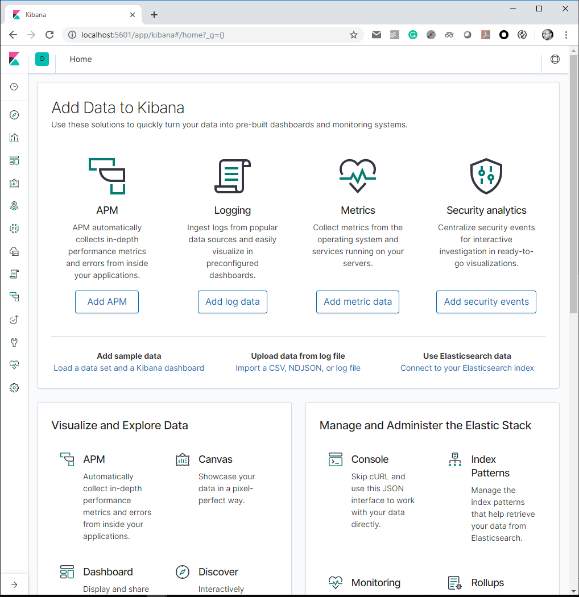

One of the things that Locust does for you when used as your testing tool is collecting request/response data. 

By default Locust periodically dumps test results and computed aggregated values like median, average response time, number of requests per second, etc.

They are presented in the UI, printed in the logs or can be persisted to a file (using - csv option).

Basically, you have access to request-specific distribution pre-aggregated data.

Most of the time, the information presented in such a way is good enough. 

In this article, I'll try to show how to deal with cases where you would like to do more with the results - correlating with some CPU/mem/IO metrics, archiving for future analysis, drawing charts, etc.  - which would require storing them in a database. 

Moreover, let's assume that having only aggregated data is not enough (for example you want to be able to analyze/drill the results down to a single request).

In one of the previous installments of this series, Locust.io experiments  - enriching results (https://medium.com/locust-io-experiments/locust-io-experiments-enriching-results-183d2ae4a4c2), I've touched on the topic of capturing atomic results. 
Now, building upon the information on how to access individual requests data, I will introduce the following elements:
* programmatically accessing aggregated request data,
* sending data to an external database,
* making sure that communication doesn't affect test performance.

See https://medium.com/locust-io-experiments/locust-io-experiments-emitting-results-to-external-db-bd3de1994259 for a detailed explanation of the code.

## Project contents
[This project](../sending-results) contains:
  * Python source code ([locust-scripts](./locust-scripts)):
    * for collecting the results (pre-aggregated and individual)
    * for sending the results to Elasticsearch
    * with example test that is producing some results
  * Dockerfile for an image containing Locust with all required dependencies installed (`elasticsearch` library)
  * bunch of docker-compose files for setting up the experiment:
    * docker-compose-elastic.yml - for Elasticsearch and Kibana
    * docker-compose-mini.yml - minimal (one node) Elasticsearch "cluster" and Kibana
    * docker-compose.yml - for locust cluster and system under test


## Building the image
As stated above, the codebase contains a Dockerfile that can be used for setting up the experiment.
Docker compose files assume it can use an image named *grubykarol/sending-experiment*.

There is a version of this image available on docker hub, but if you want to build it (or to build a modified version of it)
you could do the following:
```
docker build -t grubykarol/sending-experiment -t grubykarol/sending-experiment:0.0.2 .
```

## Running the experiment
Presented experiments can be run on any platform of choice: bare metal, VM, cloud, Kubernetes, etc. I've prepared a set of docker and docker composer files to get the advantage of the simplicity of development with docker.
The next few sections explain setting up different components of the experiment.

### Starting Elasticsearch and Kibana
Elasticsearch will collect the test results and Kibana can be used for their visualization.
There are two "flavors" of these components prepared here. One brings full 3-node Elasticsearch cluster. 

You can start it using `docker-compose-elastic.yml`:
```bash
docker-compose -f docker-compose-elastic.yml up -d
```

The other one is defined in `docker-compose-mini.yml`:
```bash
docker-compose -f docker-compose-mini.yml up -d
```

With this, Elasticsearch will be started in a single-node "development" mode (to simplify things).
If you want to have everything "clean" there, you should update the default replication factor for the indices:

```bash
curl -H "Content-Type: application/json" -XPUT "http://localhost:9200/_template/dev" -d '
{
  "order": 0,
  "index_patterns": "locust*",
  "settings": {
    "number_of_replicas": 0
  },
  "mappings": {
      "numeric_detection": true
    }
}'
```

Otherwise, the indices you create will be under-replicated (the default replication factor is 1 -- meaning Elasticserach
is trying to create one "copy" of each index -- and since we have only one node, there is no way to create the copy)
and the cluster will appear unhealthy.

### Validating Elasticsearch deployment
If Elasticsearch is up and running, it provides an HTTP-based API for controlling the cluster and accessing the data.

The simplest way to validate if Elasticsearch is running is by issuing the following request:
```curl -sS http://localhost:9200```

After this, you should see something similar to:
```
{
  "name" : "elasticsearch1",
  "cluster_name" : "docker-cluster",
  "cluster_uuid" : "SzrjlU8PQ6aS3YK5nD856g",
  "version" : {
    "number" : "7.0.1",
    "build_flavor" : "default",
    "build_type" : "docker",
    "build_hash" : "e4efcb5",
    "build_date" : "2019-04-29T12:56:03.145736Z",
    "build_snapshot" : false,
    "lucene_version" : "8.0.0",
    "minimum_wire_compatibility_version" : "6.7.0",
    "minimum_index_compatibility_version" : "6.0.0-beta1"
  },
  "tagline" : "You Know, for Search"
}
```

Docker compose scripts should also bring up Kibana. To verify if it's running, you could open `http://localhost:5601/app/kibana` in a browser.

This should display Kibana UI:


## Starting the test
To start the tests, you could use either `docker-compose.yml` or `docker-compose-headless.yml`.

These docker compose files include the following services:
* master, slave -- for creating a cluster
* standalone -- single node Locust setup
* httpbin, sut -- for emulation of a system under test and request logging (see the article for the details)

The first option kicks off Locust with the UI. You'll be able to see the statistics charts there and start and stop the test manually.

The second option starts locust without the UI and runs the test automatically for a given period. 
 
To start the test you need to bring the **test endpoint** (sut, httpbin) and **Locust** setup of your choice

For a headless setup you could do:
```bash
docker-compose -f docker-compose-headless.yml up httpbin sut master slave
```
(where you control starting individual services), or start them all together:
```bash
docker-compose -f docker-compose-headless.yml up
```

## Inspecting the results
After running the test for some time, Elasticsearch will hold the results.

From this moment, you could do whatever analysis you want. Let's examine a few examples.

There are several ways of accessing/analyzing the results:
* simple HTTP requests
* programmatically  - with a client, like the one we used to send the results (https://pypi.org/project/elasticsearch/)
* dedicated visualization tool

Let's start with a few simple queries (using *curl*) then turn to Kibana (which is a tool from Elastic that lets you
"visualize your Elasticsearch data and navigate the Elastic Stack so you can do anything from tracking query load
to understanding the way requests flow through your apps").

### Basic statistics
Let's get a few results to see the format it is stored in:
```
curl -Ss -H "Content-Type: application/json" localhost:9200/locust/_search?pretty -d '
{
  "size":5,
  "query": {
    "match_all": {}
  }
}'
```
It will return a JSON object, something like:
```
{
  "took" : 3,
  "timed_out" : false,
  "_shards" : {
    "total" : 1,
    "successful" : 1,
    "skipped" : 0,
    "failed" : 0
  },
  "hits" : {
    "total" : {
      "value" : 1809,
      "relation" : "eq"
    },
    "max_score" : 1.0,
    "hits" : [
      {
        "_index" : "locust",
        "_type" : "_doc",
        "_id" : "Qz4IZ20BfogUoBnF3JQf",
        "_score" : 1.0,
        "_source" : {
          "type" : "success",
          "payload" : {
            "request_type" : "GET",
            "name" : "/get",
            "result" : "OK",
            "response_time" : 5.785226821899414,
            "response_length" : 255,
            "other" : { }
          }
        }
      },
      ...
    ]
}
```

We see there is information on if the request was successful or note (*type* field), and the request details (stored in *payload* object)
as request type, size, name of the endpoint, response time and size.

Let's get **five slowest requests**:

```bash
curl -Ss -H "Content-Type: application/json" localhost:9200/locust/_search -d '
{
  "query": {
    "match": {
      "type": "success"
    }
  },
  "sort": {
    "payload.response_time": "desc"
  },
  "size": 5
}' | jq '.hits.hits[]._source.payload.response_time'
```

(Please, note, I am using [jq](https://stedolan.github.io/jq/) to manipulate/shorten the presented results.
You can skip it to see the whole response.)

It's time for something more complicated.
Let's inspect **what are different types of results**, different **endpoints and how many results there are** for them:
```bash
curl -Ss -H "Content-Type: application/json" localhost:9200/locust/_search -d '
{
  "query":{
    "match_all": {}
  },
  "size":0,
  "aggs":{
    "grouping_by_type":{
      "terms":{
        "field":"type.keyword"
      },
      "aggs":{
        "grouping_by_name":{
          "terms":{
            "field":"payload.name.keyword"
          }
        }
      }
    }
  }
}' | jq '.aggregations'
```

```bash
curl -Ss -H "Content-Type: application/json" localhost:9200/locust/_search -d '
{
  "query":{
    "match":{
      "type":"success"
    }
  },
  "size":0,
  "aggs":{
    "grouping_by_name":{
      "terms":{
        "field":"payload.name.keyword"
      },
      "aggs":{
        "avg_response_time":{
          "avg":{
            "field":"payload.response_time"
          }
        }
      }
    }
  }
}' | jq '.aggregations'
```

I pick a piece of the whole response to explain how to read the results:
```json
      {
        "key": "error",
        "doc_count": 441,
        "grouping_by_name": {
          "doc_count_error_upper_bound": 0,
          "sum_other_doc_count": 0,
          "buckets": [
            {
              "key": "/status/404",
              "doc_count": 441
            }
          ]
        }
      }
```
The type of the result is "error" (recorded for request that finished in error), there are 441 docs of that type (*doc_count*),
and there are 441 results for URL */status/404*.

Now, check the **average response times by URL**:
```
curl -Ss -H "Content-Type: application/json" localhost:9200/locust/_search -d '
{
  "query":{
    "match":{
      "type":"success"
    }
  },
  "size":0,
  "aggs":{
    "grouping_by_name":{
      "terms":{
        "field":"payload.name.keyword"
      },
      "aggs":{
        "avg_response_time":{
          "avg":{
            "field":"payload.response_time"
          }
        }
      }
    }
  }
}' | jq '.aggregations'
```

With the following results:
```json
{
  "grouping_by_name": {
    "doc_count_error_upper_bound": 0,
    "sum_other_doc_count": 0,
    "buckets": [
      {
        "key": "/post",
        "doc_count": 476,
        "avg_response_time": {
          "value": 6.643738065447126
        }
      },
      {
        "key": "/get",
        "doc_count": 456,
        "avg_response_time": {
          "value": 6.635955547031603
        }
      },
      {
        "key": "/delayed",
        "doc_count": 400,
        "avg_response_time": {
          "value": 4090.4237358283995
        }
      }
    ]
  }
}
```

Let's see some **percentiles**. Send the following request:
```
curl -Ss -H "Content-Type: application/json" localhost:9200/locust/_search -d '
{
  "query":{
    "match":{
      "type":"success"
    }
  },
  "size":0,
  "aggs":{
    "load_time_outlier":{
      "percentiles":{
        "field":"payload.response_time"
      }
    }
  }
}' | jq '.aggregations'
```
which produces:
```json
{
  "load_time_outlier": {
    "values": {
      "1.0": 4.651503562927246,
      "5.0": 4.971170425415039,
      "25.0": 5.747049384646946,
      "50.0": 6.653642654418945,
      "75.0": 1006.5738342285156,
      "95.0": 8006.144401041666,
      "99.0": 9007.9398046875
    }
  }
}
```

And some even more stats for successful requests to */delayed* endpoint:
```bash
curl -Ss -H "Content-Type: application/json" localhost:9200/locust/_search -d '
{
  "query": {
    "bool": {
      "filter": [
        { "term": { "payload.name.keyword": "/delayed" } },
        { "term": { "type.keyword": "success" } }
      ]
    }
  },
  "size": 0,
  "aggs": {
    "time_stats": {
      "extended_stats": {
        "field": "payload.response_time"
      }
    }
  }
}' | jq '.aggregations.time_stats'
```

```json
{
  "count": 400,
  "min": 4.570722579956055,
  "max": 9012.703125,
  "avg": 4090.4237358283995,
  "sum": 1636169.4943313599,
  "sum_of_squares": 10237234378.891014,
  "variance": 8861519.608599177,
  "std_deviation": 2976.8304635298223,
  "std_deviation_bounds": {
    "upper": 10044.084662888044,
    "lower": -1863.237191231245
  }
}
```
